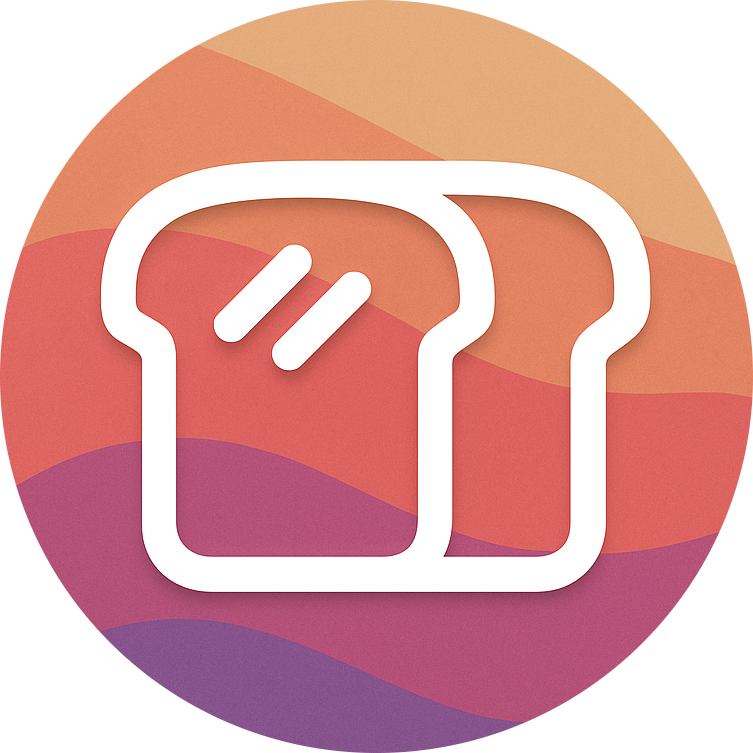

<div align="center">

# ToastyReplay

</div>

<p align="center">
  
</p>

---

### Geometry Dash's Most accurate Replay bot.
- Replay any level regardless of RNG or FPS at a frame perfect level!

Key Mechanics 
--
**Replay Menu**
* Replay any level that is recorded using the gdr and other macro formats.

* Access to **Frame Replacements** which records the exact physics of every frame in the recording. This is able to create 100% accurate replays.

**Click between Steps (native GD)**

* Full support for gd's built in Click Between Steps setting. inputs are recorded with sub-step precision and played back at the exact same step delta. no external mods needed for this one.

**Noclip (with accuracy)**

* Noclip accuracy now has limits and decimals! Very easy to use.
* **On Death Color** - screen flashes a customizable color when noclip blocks a death. has a color picker and everything, its pretty cool.

**Backdrop Blur**

* Menu has a blur effect behind it when opened, controllable with a slider in settings. makes it look clean.

**Show Hitboxes**

* Ability to view hitbox trail, on death, and normal hitboxes.

**Keybinds and settngs**

* Changeable animations, speeds, colors, and keybinds!

How it everything works... (updated for v1.2.0)
--

### Replay Engine

The engine runs in one of three modes that I created:

```cpp
enum MacroMode {
    MODE_DISABLED,  // off (pretty obvious)
    MODE_CAPTURE,   // recording inputs
    MODE_EXECUTE    // playing back inputs
};
```

Every input is stored as a `MacroAction`, which extends to [gdr](https://github.com/geode-sdk/GDReplayFormat):

```cpp
struct MacroAction : gdr::Input {
    int tick;            // frame number
    int actionType;      // 1 = jump, 2 = left, 3 = right
    bool secondPlayer;
    bool pressed;        // down or up
    float stepOffset;    // sub-step delta for Click Between steps (0 if CBS off)
};
```

Tick is calculated from the level time:

```
tick = (int)(levelTime * tickRate) + 1 
```

At 240 TPS, one second of gameplay = 240 ticks. (This is blantantly obvious im just keeping it for documentation purposes)

During `MODE_CAPTURE`, every time the `handleButton` is called, it records a `MacroAction` into the active macro. During `MODE_EXECUTE`, `processCommands` functions through stored/cached actions and fires `handleButton` when the current tick matches:
(Required to click inputs at the precice actions, Should be 100% accurate.)

```cpp
while (inputIdx < inputList.size() && tick >= inputList[inputIdx].frame) {
    auto input = inputList[inputIdx];
    GJBaseGameLayer::handleButton(input.down, input.button, input.player2);
    inputIdx++;
}
```

Replays are saved as .gdr files in the mod's save directory under `replays/`. This is
also viewable from the Open Folder button on the Replay tab.

### Frame Replacement (Best Accuracy Mode imo)

Three correction modes:

| Mode | what it does |
|------|-------------|
| None | No correction of inputs, raw input calculation only |
| Input Adjustments | caches the position snapshots on each input (Very Unreliable) |
| Frame Replacement | caches the position snapshots every `N` ticks (default 240) |

During recording, position corrections are stored to keep physics acurate:

```cpp
struct PositionCorrection {
    int tick;
    PositionSnapshot player1Data;  // position plus the rotation
    PositionSnapshot player2Data;
};
```

During playback, the engine teleports the player to the recorded position and rotation at each correction tick. This is what makes the replays frame perfect even though there are technicalities.

### Physics Bypass (TPS)

The engine hooks `GJBaseGameLayer::update` with a fixed time step accumulator:

```
targetDelta = 1.0 / tickRate
```

Each frame, `dt` is added to the accumulation. The game steps forward in a fixed `targetDelta` chunk until the accumulation is empty. And only the last step renders visuals (the rest skip `updateVisibility` which improves lag I guess? idk).

Speed control hooks `CCScheduler::update` and scales the delta:
(Don't lock delta using external client it will break.)

```cpp
void update(float dt) {
    CCScheduler::update(dt * gameSpeed);
}
```

Frame advance (`tickStepping`) freezes the accumulation and only steps once per key press. (variation depending on the current Physics.)

### Noclip + Accuracy

Noclip hooks `PlayLayer::destroyPlayer` and blocks the death call. Each blocked death updates `bypassedCollisions`, and `totalTickCount` tracks the total amount of ticks elapsed.

```
accuracy = 100.0 * (1.0 - bypassedCollisions / totalTickCount)
```

If `collisionLimitActive` is set and the accuracy drops below the `collisionThreshold`, noclip temporarily disables and the player gets viciously spiked.

**On Death Color** - when enabled, a `CCLayerColor` overlay flashes the picked color on the screen whenever noclip blocks a death. uses `CCFadeTo` to fade out over 0.25 seconds so its not annoying. color is fully customizable from the noclip settings. basically like megahack but built in lol

### Click Between Steps (native)

When gd's native Click Between Steps setting is enabled (game variable "0177"), inputs can happen between physics ticks. The engine tracks this using `GJBaseGameLayer::m_currentStep`:

```
stepDelta = m_currentStep - tickStartStep
```

during recording, each input captures its step delta within the current tick. during playback, inputs only fire when both the tick AND the step delta match, so the exact sub-step timing from the original run is preserved.

CBF macros are tagged in the replay list with a red "CBF" label. the engine automatically enables/disables the Click Between Steps game variable when loading CBF macros so you dont have to toggle it manually.

This replaced the old syzzi Click Between Frames mod integration. no external mods needed anymore, its all native now.

### Trajectory  (Player Path Preview - PPP) I like abreviating things tehe

Creates some invisible cloned `PlayerObject`s on level load. Each frame, the system:

1. Copies the real player's full state onto the clone
2. Simulates `N` frames ahead (default is 312) by calling `checkCollisions` plus `update` and `updateRotation`
3. Draws lines between each simulated position (Broken with 2 player im aware)

Green = holding jump, red = released, yellow = overlap between hold/release paths. Lines fade out over the last 40 frames. (Inaccuracy is apparent, do NOT use Trajectory if you don't use Show Hitboxes.)

Portal interactions (speed changes, size changes) are handled during simulation. Ring states are saved before simulation and restored after so the preview doesn't affect actual gameplay. (Cashing for orbs on p2 layer. This is broken fixed in v1.2.0)

### Hitboxes

So Hitboxes Hooks `GJBaseGameLayer::updateDebugDraw` to render the player, spikes and collision rectangles/squares. Player hitboxes are rotated using a 2D rotation around the rects center:

```
newX = cx + (x - cx) * cos(angle) - (y - cy) * sin(angle)
newY = cy + (x - cx) * sin(angle) + (y - cy) * cos(angle)
```

Trail mode keeps the player rects in a `deque` each tick, like FOLK I need to change this... But then it's capped at `hitboxTrailLength`. On Death only mode clears the draw nodes until the player dies.

### Checkpoint Handling (For Recording)

When a checkpoint is placed during recording, the engine snapshots:

```cpp
struct RestorePoint {
    int tick;
    PhysicsSnapshot player1State;  // 250 fields of player physics 
    PhysicsSnapshot player2State;
    uintptr_t rngState;            // RNG seed cause why not
    int priorTick;
};
```

Loading a checkpoint truncs all recorded actions and fixes after that tick, restores the RNG state, and resets the deffered input tracking. This allows recording in practice mode without rewriting the file or corrupting the macro.

### RNG Lock

Locks the game's internal `randomState` using a seed from user input plus current level progress:

```cpp
std::mt19937 gen(rngSeedVal + currentProgress);
std::uniform_int_distribution<uint64_t> dist(10000, 999999999);
GameToolbox::fast_srand(dist(gen));
```

This makes levels with random trigger stuff set identically across attempts.

### Safe Mode

Hooks the three functions to prevent progress from being saved:

- `PlayLayer::levelComplete` → sets `m_isTestMode = true` before calling the original
- `PlayLayer::showNewBest` → blocks the call entirely
- `GJGameLevel::savePercentage` → blocks the call entirely

### Menu

made with [ImGui Cocos](https://github.com/geode-sdk/imgui-cocos). Four module tabs: Replay, Tools, Hacks, Settings.

The theme engine supports custom accent/background/card/text colors, corner radius, opacity, and RGB color cycling (RGB Cycling). All settings persist through the Geode saved values (Courtesy the API)

Animations use eased transitions:

```cpp
// ease out cubic (GD ahh easing)
float easeOutCubic(float t) {
    float inv = 1.0f - t;
    return 1.0f - inv * inv * inv;
}
```

Menu entrance direction is changeable (center scale, move from any edge). Toggle switches and move states are individually animated per the widget using tracked `ImGuiID` maps.

**Backdrop Blur** - when the menu opens it draws layered semi-transparent rectangles on the background to simulate a blur effect. intensity is controllable with a slider from 0 to 1. theres also a vignette effect on the edges because it looked cool. the blur color matches your background color setting so it blends in nicely.

---

Extended information
--

credits go to: 

- [Figment](https://github.com/FigmentBoy) for permission to use some of [zBot's](https://github.com/FigmentBoy/zBot) features like trajectory and replay features. 
- [Zilko](https://github.com/Zilko) for inspiring me (from [xdBot](https://github.com/Zilko/xdBot))
- [Jarvisdevil](https://github.com/thejarvisdevil) for helping me put my braincells together.
- [NinXout](https://github.com/ninXout) for inspiration similar to Eclipse Menu. (Received help for my hitbox implementation)
- And of course, [Geode](https://github.com/geode-sdk) for the amazing framework this is built upon.

* Monthly updates will be added to improve customization, add features, and most importantly squash bugs! If you find any bugs please report them in my discord. or in my issues page on the ToastyReplay Repository.

https://discord.gg/JWkVm7cUhH
https://github.com/ToastexGD/ToastyReplay/issues

Thanks everyone! <3