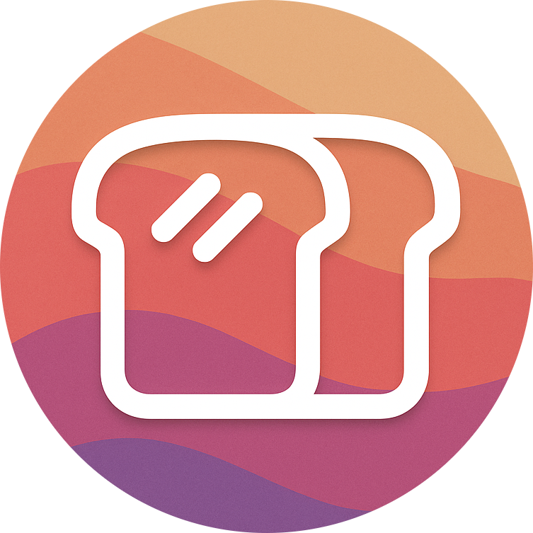

<div align="center">

# ToastyReplay



**Geometry Dash's most accurate replay bot.**

Record, playback, edit, convert, and render frame-perfect macros with 100% accuracy.

[](https://geode-sdk.org)
[](https://store.steampowered.com/app/322170/Geometry_Dash/)
[](https://github.com/ToastexGD/ToastyReplay/releases)
[](https://discord.gg/JWkVm7cUhH)

</div>

---

## Features

<table>
<tr>
<td width="50%" valign="top">

### Recording & Playback
- Frame-perfect macro recording at any TPS
- Two native formats: **TTR2** (the new compact binary, default) and **GDR** (legacy support kept around)
- Legacy **TTR** files auto-detected and loaded with no extra steps
- Full two-player and platformer macro support
- Practice mode recording with checkpoint snapshots
- Start position support with tick offset

</td>
<td width="50%" valign="top">

### Accuracy Modes
- **Vanilla** for standard frame-by-frame (No sub-step compatability)
- **CBS** (Click Between Steps) for native sub-step timing (ingame option)
- **CBF** (Click Between Frames) via Syzzi's mod

</td>
</tr>
<tr>
<td width="50%" valign="top">

### Macro Conversion (new in v2)
- Import macros from **30+ external replay bots** and convert to TTR2 or GDR
- Supports: MegaHack JSON/Binary, TasBot, zBot, OmegaBot, YBot / YBot 2, xdBot, XBot, Echo, Amethyst, Osu Replay, GDMO, ReplayBot, Rush, KDBot, DDHOR, QBot, RBot, Zephyrus, ReplayEngine 1/2/3, Silicate 1/2/3, GDR2, UvBot, TCBot, and plaintext dumps
- Auto-detects the source format, surfaces unsupported edge cases with a warning instead of silently breaking
- Conversions panel lives in the Replay tab (collapsible if you dont care)

</td>
<td width="50%" valign="top">

### Frame Editor
- Visual timeline with drag and edit input segments
- Zoom, scroll, and overview bar for ease of access
- Per-player input lanes (for 1 and 2 player)
- Full undo/redo with a commit-based history (200 in depth)
- Drag edges to resize holds, move segments to retime inputs
- Each input is frame changeable, Macro editor will NEVER support CBS/CBF macros.

</td>
</tr>
<tr>
<td width="50%" valign="top">

### Video Rendering
- FFmpeg API export (720p to 4K, any FPS)
- Configurable codec, bitrate, and pixel format
- in game audio, click sounds, or both
- Volume control and music fade support (Music fade may break on high TPS)
- Hide end screen / level complete popup
- Extended fallback for FFmpeg.exe for extra customizability.

</td>
<td width="50%" valign="top">

### Click Sounds
- Custom click pack ability with hard/soft clicks and releases
- Separate packs for Player 1 and Player 2
- Softness slider, click delay randomization (For SpaceUK)
- Background noise loop option
- Hold/release buffer fix so packs dont cut off mid-press anymore

</td>
</tr>
<tr>
<td width="50%" valign="top">

### Hacks & Tools
- **Noclip** with accuracy %, Death limits, and customizable death flash.
- **Hitboxes** (always-on, on-death, or trail mode)
- **Trajectory** preview (300 frames ahead as a max), now backed by a dedicated physics sim module
- **Safe Mode**, **Layout Mode**, **No Mirror**
- **Disable Shaders** to kill all level shader effects in one click
- **Autoclicker** with per-player configuration (1 and 2 player)
- **RNG Lock** for random triggers (duhh)
- **Speed Control** with audio pitch sync
- **Frame Advance** (tick-by-tick/frame-by-frame stepping)

</td>
<td width="50%" valign="top">

### Online
- Discord login via device-code pairing (the 6-character code thing, no more 32-char hex session)
- Refresh-token auth against the macro backend so a session lasts way longer
- Macro uploading (TTR / TTR2 / GDR)
- Bug report submission from in-game

</td>
</tr>
<tr>
<td width="50%" valign="top">

### Customization
- built-in themes + full custom colors
- Rebindable hotkeys for every feature
- Glow cycle animation
- Animated menu transitions
- **Star ambient background** (new), drifting twinkles + occasional streaks
- UI Language setting (English + Spanish for now)

</td>
<td width="50%" valign="top">

### Engine & Tooling
- Geode SDK **v5.7.1**
- Watermark module runs as a runtime-loaded DLL with SHA-256 integrity check (bundled inside the .geode, no extra install)
- Fixed timestep accumulator for TPS control, stable up to a million TPS

</td>
</tr>
</table>

---

## How It Works

> Everything below is updated for **v2.0.2**. If you want the quick version, just read the Features table above. (I hid the stuff below into dropdowns to save your eyes)

---

<details>
<summary><h3>Replay Engine</h3></summary>

The engine has three modes. crazy stuff am I right?

```cpp
enum MacroMode {
    MODE_DISABLED,  // go away
    MODE_CAPTURE,   // recording your inputs
    MODE_EXECUTE    // playing them back
};
```

Every input gets stored as a `MacroAction` extending [TTR2] or [GDR](https://github.com/geode-sdk/GDReplayFormat):

```cpp
struct MacroAction : gdr::Input {
    int tick;            // what frame the icon is on
    int actionType;      // 1 = jump, 2 = left, 3 = right (2 and 3 are useless rn anyway)
    bool secondPlayer;   // player 2 thingie
    bool pressed;        // button held down or up.
    float stepOffset;    // sub-step delta for CBS (0 is off)
};
```

Tick number comes from level time:

```
tick = (int)(levelTime * tickRate) + 1
```

During recording, every `handleButton` call saves a `MacroAction`. During playback, `processCommands` walks through the stored actions and fires them when the tick fits:

```cpp
// fire every action whose tick has arrived
while (inputIdx < inputList.size() && tick >= inputList[inputIdx].frame) {
    auto input = inputList[inputIdx];
    GJBaseGameLayer::handleButton(input.down, input.button, input.player2);
    inputIdx++;  // next one
}
```

Replays live as `.ttr` or `.gdr` files in the mod's save directory under `replays/`. The engine auto-detects v1 TTR vs the new TTR2 layout when loading, so old macros just keep working.

</details>

---

<details>
<summary><h3>TTR2 Format (v2.0.0+)</h3></summary>

The new native format. Same `TTR\0` magic, bumped internal version, still zlib-compressed. Way smaller than GDR files and stores more metadata about the run.

```
Header: "TTR\0" format version + flags
Payload: compressed metadata + inputs + anchors
```

**Flags stored per-macro:**

| Flag | What I mean |
|------|--------------|
| `TTR_FLAG_ACCURACY_CBS` | Recorded with Click Between Steps |
| `TTR_FLAG_ACCURACY_CBF` | Recorded with Click Between Frames |
| `TTR_FLAG_FROM_START_POS` | Started from a custom start position |
| `TTR_FLAG_PLATFORMER` | Platformer mode level |
| `TTR_FLAG_TWO_PLAYER` | Two-player level |
| `TTR_FLAG_RNG_LOCKED` | RNG was locked during recording |

**Metadata includes:** author, level name, level ID, framerate, duration, game version, and a unix timestamp of when it was recorded. (Level ID is 0 if in the editor or playback)

**Playback Anchors** are checkpoint snapshots saved every 240 ticks (1 second). They store both players' full state (position, velocity, rotation, gravity, holds) plus the RNG seed. During playback the engine compares live state against anchors to catch and correct physics drift.

Legacy TTR (v1.3.0 builds) and GDR are both still supported. The replay list automatically detects the format and tags it on the row so you know what you're loading.

</details>

---

<details>
<summary><h3>Macro Conversion</h3></summary>

New in v2.0.0. Drop a macro from basically any other replay bot into the `replays/` folder and ToastyReplay will sniff out the format and let you convert it to TTR2 or GDR.

**Supported source formats:**

| Group | Formats |
|-------|---------|
| MegaHack | JSON + Binary |
| TasBot | TasBot JSON |
| zBot | ZBot Frame |
| OmegaBot | OmegaBot |
| YBot | YBot Frame, YBot 2 |
| xdBot family | xdBot, XBot Frame |
| Echo | Echo |
| Amethyst | Amethyst |
| Osu | Osu Replay |
| Old stuff | GDMO, ReplayBot, Rush, KDBot, DDHOR, Plaintext |
| Q/R/Z bots | QBot, RBot, Zephyrus |
| ReplayEngine | 1, 2, 3 |
| Silicate | 1, 2, 3 |
| GDR2 | GDR2 |
| Others | UvBot, TCBot |

The conversion runs on a background thread so the menu doesnt freeze on huge macros. If a format is half-busted or missing fields (cough, some MegaHack binary dumps cough) you get a warning instead of a silent failure. Once a foreign macro is converted its source row gets tagged "Converted" so you dont accidentally do it twice.

Conversions never overwrite the source file. The new .ttr / .gdr lands next to it in the `replays/` folder under whatever name you typed in the convert panel.

</details>

---

<details>
<summary><h3>Accuracy Modes</h3></summary>

Three tiers of input precision:

| Mode | How it works | External mod needed? |
|------|-------------|---------------------|
| **Vanilla** | Standard frame-by-frame. One input per tick. | No |
| **CBS** (Click Between Steps) | Uses GD's native `m_currentStep` to record sub-step timing. Inputs Fire at the exact step delta within a tick. | No |
| **CBF** (Click Between Frames) | Micro precision timing via syzzi's Click Between Frames mod. This is real tuff | Yes (`syzzi.click_between_frames`) |

For CBS, the engine tracks where in the tick the input happened:

```
stepDelta = m_currentStep - tickStartStep
```

During playback, both the tick AND the step delta have to match before the input fires. This preserves the exact sub-step timing from the original run.

The input timing system queues the sheer raw inputs with microsecond timestamps and converts them to fractional step phases. Up to 32 pending inputs can be queued at once.

Macros are tagged in the replay list so you know what accuracy mode they were recorded with. The engine auto-toggles the CBS game variable when loading those macros so you dont have to do it manually.

</details>

---

<details>
<summary><h3>Physics Bypass (TPS Control)</h3></summary>

Hooks `GJBaseGameLayer::update` with a fixed timestep accumulator:

```
targetDelta = 1.0 / tickRate
```

Each frame, `dt` gets added to the accumulator. The game steps forward in `targetDelta` chunks until the accumulator is drained. Only the last step renders visuals (the rest skip `updateVisibility` which helps with performance. I mean I would assume but my high end PC is to good).

Speed control hooks `CCScheduler::update` and scales delta:

```cpp
void update(float dt) {
    // dont use an external client to lock delta. it WILL break.
    CCScheduler::update(dt * gameSpeed);
}
```

**Frame Advance** freezes the accumulator and only steps once per key press. Hold the step key for continuous stepping. Great for debugging or placing precise inputs.

</details>

---

<details>
<summary><h3>Checkpoint System</h3></summary>

When you place a checkpoint during recording, the engine snapshots everything:

```cpp
struct CheckpointStateBundle {
    int priorTick;                  // where we were
    PlayerStateBundle player1State; // position, velocity, rotation, gravity, holds
    PlayerStateBundle player2State; // same thing but for player 2
    uintptr_t rngState;            // gotta keep the randomness consistent
    uint8_t latchMasks[2];         // which buttons were being held
};
```

`PlayerStateBundle` captures kinematics (position, velocity, rotation), flags (upside down, holding), and environment state (gravity, dual mode, 2-player). It's a lot of fields. Like, a LOT.

Loading a checkpoint truncs all recorded actions after that tick, restores the RNG, and resets the defferred input tracking. This lets you record in practice mode without corrupting the macro. The engine also handles start position detection and validates tick offsets when loading macros recorded from non-zero positions.

</details>

---

<details>
<summary><h3>Noclip + Accuracy</h3></summary>

Hooks `PlayLayer::destroyPlayer` and says stop. Each blocked death bumps `bypassedCollisions`, and `totalTickCount` tracks total ticks elapsed:

```
accuracy = 100.0 * (1.0 - bypassedCollisions / totalTickCount)
```

If `collisionLimitActive` is on and accuracy drops below `collisionThreshold`, noclip turns off and you get absolutely destroyed. Skill issue.

**On Death Flash** overlays a `CCLayerColor` that flashes your chosen color whenever noclip blocks a death. Fades out over 0.25s. Color is fully customizable (RGB picker). Basically megahack but built in.

</details>

---

<details>
<summary><h3>Trajectory Preview</h3></summary>

Creates invisible cloned `PlayerObject`s on level load. Every frame:

1. Copy the real player's full state onto the clone
2. Simulate `N` frames ahead (default 312) via the dedicated `trajectory::physics` module — same collision + ring + pad + portal logic as the real game, just driven manually
3. Draw lines between each simulated position

New in v2: the physics sim got pulled into its own module so portals, dash rings, pads, and bumps line up with the actual gameplay path way closer than before.

**Color coding:**
- **Green** = holding jump
- **Red** = released
- **Yellow** = where hold and release paths overlap
- **Blue overlay** = player 2

Lines fade out over the last 40 frames. Portal interactions (speed, size, gravity) are handled during simulation. Ring and pad states get saved before simulation and restored after so the preview doesnt mess with actual gameplay.

> Trajectory has very hit-or-miss accuracy. If you're doing precise stuff, use it alongside Show Hitboxes.

</details>

---

<details>
<summary><h3>Hitbox Visualization</h3></summary>

Hooks `GJBaseGameLayer::updateDebugDraw` to render collision geometry.

**Three display modes:**
- **Always** - hitboxes visible at all times
- **On Death** - only shows when the player dies
- **Trail** - keeps a rolling history of player hitbox positions (capped at `hitboxTrailLength`, default 240)

**Color coding:**

| Object Type | Color |
|------------|-------|
| Solid blocks | Blue |
| Hazards (spikes etc) | Red |
| Passable objects | Cyan |
| Interactive (orbs, pads) | Green |
| Player | Red outline, blue inner |
| Coins | Green |
| Slopes | Blue |

Player hitboxes are rotated using 2D rotation around the rect center:
(Im planning to add customization for the hitbox colors soon, please be patient)

```
newX = cx + (x - cx) * cos(angle) - (y - cy) * sin(angle)
newY = cy + (x - cx) * sin(angle) + (y - cy) * cos(angle)
```

Supports rectangles, circles, triangles, and oriented quads.

</details>

---

<details>
<summary><h3>Frame Editor</h3></summary>

A full visual timeline editor for your macros. Got a big upgrade in v2 with a proper commit-based history model so undo/redo never gets out of sync with the file on disk.

**What you see:**
- Horizontal ruler with frame tick marks
- Input lanes for Player 1 and Player 2 (separate, color-coded)
- Hold segments showing press-to-release duration
- Overview bar at the top showing the full macro

**What you can do:**
- **Drag segments** to move them in time
- **Drag edges** to adjust when a press or release happens
- **Scroll and zoom** (0.5x to 40x pixels per frame of superzoom)
- **Go to frame** for quick navigation
- **Undo/redo** with a 200-entry stack limit, every edit gets recorded as a commit
- **Delete inputs** and adjust step offsets

Supports both TTR2 and GDR formats. Auto-detects two-player macros and shows both lanes. Player 2 gets a different color so you can tell them apart.

Unsaved changes trigger a confirmation dialog when you try to close. Because losing edits sucks (I lost a bunch while testing)

</details>

---

<details>
<summary><h3>Video Rendering</h3></summary>

FFmpeg API video export. Uses the FFmpeg API mod when available, falls back to piping frames to `ffmpeg.exe`.

**pipelin:**
1. Capture each frame to an OpenGL FBO at the set resolution
2. Stream raw RGB24 frames to FFmpeg (buffered, up to 8 frames)
3. FFmpeg encodes to your chosen codec
4. After gameplay ends, mux audio (game music + click sounds if enabled)

**Settings you can tweak:**

| Setting | Default | Options |
|---------|---------|---------|
| Resolution | 1920x1080 | 720p, 1080p, 1440p, 4K, or custom |
| FPS | 60 | Whatever you want |
| Codec | libx264 | Falls back to libx265, h264, mpeg4, vp9 |
| Bitrate | 30M | In megabits |
| Format | .mp4 | Whatever FFmpeg supports |

**Audio options:**
- Include/exclude background music and click sounds separately
- Volume sliders for music and SFX
- Music fade-in/fade-out
- Configurable duration after level completion (default 3 seconds)

**Display options:**
- Hide end screen
- Hide level complete popup
- Hide completion particles

Click sounds are pre added at the render's sample rate and mixed in at the exact frame they should play. The renderer handles song file detection for both custom and built-in level music.

The watermark module is a runtime-loaded DLL bundled inside the .geode. On launch it gets SHA-256 verified against an embedded hash, so a tampered build refuses to render instead of quietly producing dodgy output.

</details>

---

<details>
<summary><h3>Click Sounds</h3></summary>

Custom click pack system. Each pack is a folder with subfolders for different sound types:

```
my-click-pack/
  clicks/          (or hard/hardclicks)
  softclicks/      (or soft/softclick)
  hardreleases/    (or hardrelease)
  softreleases/    (or softrelease)
  releases/        (generic releases)
  noise/           (or background/bg/mic)
```

**Controls:**
- **Softness slider** (0 to 1) controls the ratio of hard vs soft clicks
- **Click delay** (min/max ms) adds random delay variation
- **Background noise** toggle with volume slider
- **Separate P1/P2 packs** for two-player mode

Clicks play in real-time during recording and playback. For renders, all sounds get pre added and mixed into the final audio at precise frame offsets. The system picks randomly from available sound files each time so it doesnt sound robotic.

v2 fixed the hold/release buffer issue where packs with long release samples could cut off if you pressed again before the previous release finished playing.

</details>

---

<details>
<summary><h3>RNG Lock</h3></summary>

Locks the game's random state using a seed derived from your input plus level progress:

```cpp
std::mt19937 gen(rngSeedVal + currentProgress);
std::uniform_int_distribution<uint64_t> dist(10000, 999999999);
GameToolbox::fast_srand(dist(gen));  // now every attempt is the same
```

Makes levels with random triggers behave identically across attempts. The RNG state is also stored in checkpoints and playback anchors so it stays consistent even when loading from practice mode

</details>

---

<details>
<summary><h3>Safe Mode</h3></summary>

Hooks three functions to prevent progress from being saved:

- `PlayLayer::levelComplete` sets `m_isTestMode = true` before calling the original
- `PlayLayer::showNewBest` gets blocked entirely
- `GJGameLevel::savePercentage` also blocked

You still see the level complete screen normally, it just doesnt save anything. A "Safe Mode Active" label shows on the end screen so you know its working

</details>

---

<details>
<summary><h3>Other Tools</h3></summary>

**Layout Mode** strips all decoration from the level and shows only gameplay objects. Uses a ID catalog to filter out decorative and trigger objects. Everything gets forced to a clean monochrome look. Great for focusing on the actual gameplay.

**No Mirror** blocks mirror/flip portal effects. Can be set to only apply during recording if you want normal visuals during playback.

**Disable Shaders** (new in v2) kills every shader layer the level applies, so you can practice in the unshaded view without editing the level.

**Audio Pitch Control** adjusts FMOD's master channel pitch proportional to game speed. So 2x speed = 2x pitch. Automatically disabled during rendering to prevent audio desync.

**Autoclicker** with separate P1/P2 toggles, configurable hold/release duration in ticks, and a "only while holding" mode. Shows calculated CPS based on your engine TPS.

</details>

---

<details>
<summary><h3>Menu & Theming</h3></summary>

Built with [ImGui Cocos](https://github.com/geode-sdk/imgui-cocos). Six tabs: **Replay**, **Render**, **Clicks**, **Autoclicker**, **Settings**, **Online**.

**Theme engine** supports:
- built-in preset themes
- Custom accent, background, card, and text colors
- Corner radius and text scale
- Glow cycle animation with adjustable speed
- **Star ambient background** (new) — drifting twinkle particles plus the occasional streak

Animations use eased transitions:

```cpp
float easeOutCubic(float t) {
    float inv = 1.0f - t;
    return 1.0f - inv * inv * inv;  // smooth like the GD ahh easing
}
```

Toggle switches, tab transitions, and card expansions are all individually animated. Every keybind is rebindable with conflict detection. All settings persist through Geode's saved values.

**UI Language** is configurable from the mod settings — English and Spanish are bundled in v2, with more coming as translations roll in.

</details>

---

<details>
<summary><h3>Online Features</h3></summary>

**Discord Integration** uses a device-code pairing flow now. The menu shows a 6-character code, you open your browser, paste it, approve, done — no more dealing with 32-char hex session strings. After linking, your avatar + username + Discord ID show up in the Online tab.

**Refresh-Token Auth** keeps you signed in across game restarts. The client holds a refresh token that rotates on every refresh, and a session is good until you click Unlink or the backend revokes it.

**Macro Upload** lets you share macros to the cloud with metadata (level name, ID, TPS, action count, duration) and an optional comment. Supports TTR, TTR2, and GDR.

**Issue Reporting** so you can submit bug reports with a title and description straight from in the game.

</details>

---

## Credits

- [Figment](https://github.com/FigmentBoy) for permission to use some of [zBot's](https://github.com/FigmentBoy/zBot) features like trajectory and replay features.
- [Zilko](https://github.com/Zilko) Original ideas of Frame Fixing from [xdBot](https://github.com/Zilko/xdBot)) Which is now changed.
- [Jarvisdevil](https://github.com/thejarvisdevil) for helping me put my brain cells together.
- [NinXout](https://github.com/ninXout) Great open-source reference for overall, highly recommend checking them out.
- [C++ and C++ Together Discords](https://discord.gg/WeBHv6b4WS) for helping me learn C++ and their amazing guides.
- [GDH by Toby](https://github.com/TobyAdd/GDH/blob/main/LICENSE) for being an amazing open source reference to fix up trajectory, hitboxes, and a bunch of other bugs.
- My loyal Playtesters: therealkeanan00, xen_dnr, 
- Everyone who gave weird macros to the DB so I could fix the replay engine bug 😭
- And of course, [Geode](https://github.com/geode-sdk) for the amazing framework this is built on. <3

---

<div align="center">

Updates will come to add features and squash bugs. If you find anything broken, msg me on Discord or make a ticket at https://Toastyreplay.xyz

[](https://discord.gg/JWkVm7cUhH)
[](https://github.com/ToastexGD/ToastyReplay/issues)

Thanks everyone! <3

</div>

---
